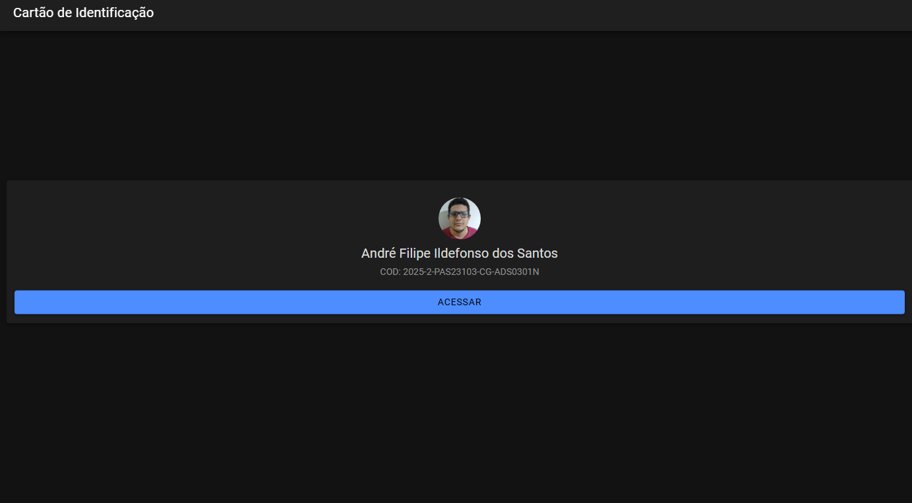
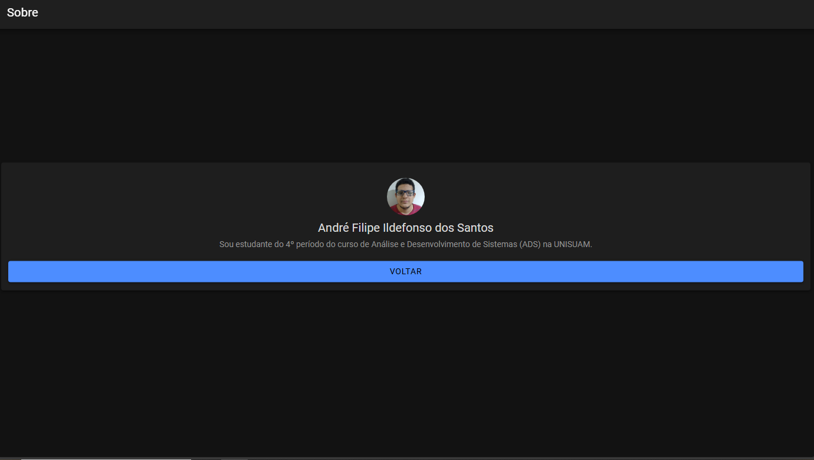

📘 Avaliação Formadora 1 – Desenvolvimento de Aplicativos Mobile  
## Cartão Digital de Identificação

**Aluno:** André Filipe Ildefonso dos Santos  
**Turma:** [PAS23103] (2025-2-PAS23103-CG-ADS0301N)  
**Disciplina:** Desenvolvimento de Aplicativos Mobile  
**Instituição:** [Nome da sua instituição]

---

## 🔗 Link do Repositório

Este projeto foi desenvolvido com o framework **Ionic**, utilizando o template “blank” e testado diretamente no navegador com o comando `ionic serve`.

🔗  link do git hub: https://github.com/AF148/formadora-I

---

## 🖼️ Capturas de Tela

### Tela 1 – Cartão de Identificação  
Exibe nome completo, código da turma, foto e botão de navegação para a tela "Sobre".

---

### Tela 2 – Sobre  
Apresenta um breve texto sobre o aluno e botão para retornar à tela inicial.

---

## 📝 Texto de Apresentação

> Olá! Sou André Filipe, estudante apaixonado por tecnologia e programação. Este aplicativo foi desenvolvido como parte da disciplina de Programação Móvel, com o objetivo de criar um Cartão Digital de Identificação simples e funcional. Através dele, colegas e professores podem conhecer um pouco mais sobre mim e navegar entre as telas de forma intuitiva.

